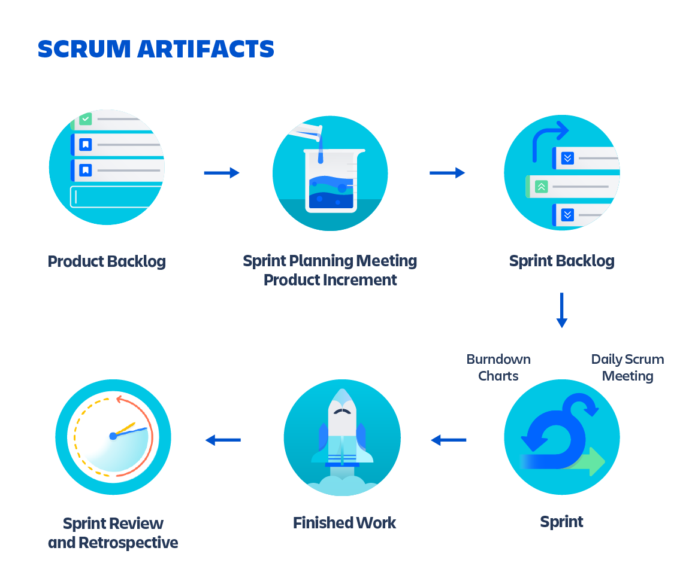

# Ciclo SCRUM

## Pilares de los equipos de SCRUM

[]

### Transparencia

En el centro del scrum se encuentra la transparencia, un principio fundamental que se centra en la comunicación abierta y sin obstáculos. La transparencia es la base de la confianza y la colaboración, ya que promueve un intercambio de información claro y sincero entre todas las partes interesadas del proyecto.

#### Ventajas de la transparencia en el scrum

- Toma de decisiones fundamentada: cuando todos los miembros del equipo y las partes interesadas tienen acceso a información actualizada y precisa, pueden tomar decisiones bien fundamentadas que se ajusten a los objetivos del proyecto.

- Detección temprana de problemas: con una comunicación transparente se exponen los problemas y obstáculos al principio del proceso de desarrollo, lo que permite a los equipos abordarlos rápidamente antes de que se agraven.

- Mejora de la implicación: con una visibilidad clara de las tareas y del progreso de cada miembro del equipo, se promueve la implicación y se alienta a las personas a responsabilizarse de su trabajo.

- Participación de las partes interesadas: con informes transparentes, las partes interesadas se involucran en alcanzar los resultados del proyecto, lo que se traduce en una mejor colaboración y un compromiso compartido.

- Gestión de riesgos: los procesos transparentes permiten a los equipos identificar y gestionar los riesgos potenciales, lo que minimiza su impacto en los plazos y los resultados del proyecto.

### Inspeccion

La inspección, el segundo pilar, gira en torno a una evaluación y una revisión coherentes. Los equipos pueden identificar las desviaciones mediante evaluaciones periódicas, lo que fomenta la mejora y mantiene la trayectoria hacia el éxito del proyecto.

#### Puntos de inspección frecuentes en el SCRUM

El scrum hace hincapié en la inspección regular y frecuente del progreso del proyecto y del producto en sí.

El carácter iterativo del scrum permite que cada punto de inspección contribuya al siguiente sprint, para realizar mejoras graduales e incorporar los comentarios de las partes interesadas.

### Adapacion

La adaptacion va de la mano de la inspección. Una vez que el equipo ha inspeccionado el producto y los procesos, adapta sus estrategias en función de los conocimientos adquiridos. A medida que los equipos descubren nueva información y entienden mejor la dinámica de sus proyectos, pueden corregir el rumbo de una forma ágil.
la adaptabilidad es fundamental para el éxito del scrum. En las siguientes secciones.

#### La adaptación en el scrum ofrece varias ventajas:

- Flexibilidad: adaptarse a los cambios de requisitos o a los desafíos inesperados mejora la flexibilidad y la capacidad de respuesta del equipo.

- Mejora de la calidad: la adaptación continua permite incorporar los comentarios, lo que se traduce en productos de mayor calidad y en una mayor satisfacción de los usuarios.

- Procesos optimizados: al adaptar los procesos en función de las conclusiones de las retrospectivas, los equipos perfeccionan sus flujos de trabajo y se vuelven más eficientes con el tiempo.

- Satisfacción de los clientes: la adaptación permite que el producto se ajuste a las necesidades del cliente, lo que se traduce en una mayor satisfacción.

## Artefactos de SCRUM

### Backlog del producto

El backlog del producto es un artefacto “vivo”, en el sentido de que se actualiza a medida que se dispone de nueva información. Se trata de un backlog compartido entre varios equipos que el propietario del producto mantiene y organiza entre los ciclos de sprints y conforme van surgiendo nuevas ideas. Contiene tareas que una vez estuvieron en un sprint activo, pero que dejaron de ser prioritarias y pasaron al backlog.

### Backlog de sprint

El backlog de sprint es un conjunto de tareas del backlog del producto que se han impulsado para desarrollarse durante el siguiente incremento del producto. Los equipos de desarrollo crean los backlogs de sprints para planificar las entregas de cara a los futuros incrementos y detallar el trabajo necesario para concebir el incremento.

### Incremento del producto

Un incremento del producto es la entrega al cliente que tiene lugar al completar las tareas del backlog del producto durante un sprint. También incluye los incrementos de todos los sprints anteriores. Siempre hay un incremento por cada sprint y tal incremento se decide durante la fase de planificación de scrum. Los incrementos se dan cuando el equipo opta por lanzar una publicación al cliente. Los incrementos del producto resultan sumamente útiles y complementan la CI y la CD en el seguimiento de versiones y, si es necesario, en su reversión.

### CI/CD

##### CI/Continuous Integration

Para ayudar a tener un repositorio común de código y que no lo pierdas todo. Si no guardas, necesitarás un sistema de control de versiones que también te ayudará si hay conflictos al mergear el código a master (dos personas cambian por ejemplo el mismo fichero a la vez). Para integrar las partes se suele necesitar un servidor independiente y que cada vez que alguien suba código al control de versiones este servidor compile todo el producto, pase todos los tests y lance una alarma si fallan (los tests o la build). Un problema en la integración debe ser la prioridad del equipo, no se puede dejar la build rota o que no pasen los tests porque entonces trabajamos sobre algo inestable (bloqueamos a todo el equipo). 

Ci tiene como objetivo el mantener un orden el cual permita:

- Varias personas trabajando de manera independiente en la misma base de código sin bloquearse.

- Integrar las partes que se realicen y que todo funcione. Vamos, evitar la famosa frase «en mi ordenador funcionaba»

##### CD/Continuous Delivery/Deployment

Se basa en reducir el tamaño de lo que subimos para reducir riesgos e iterar sobre esos pequeños cambios. ¡Si nos estamos equivocando queremos saberlo cuánto antes! Cuando subes a producción cada tres meses, la cantidad de código que acumulas es descomunal y el riesgo de introducir bugs es similar. Si lo haces cada dos semanas, bajas el riesgo y también tamaño de la subida. Así que, el tamaño de lo que subimos es inversamente proporcional a la frecuencia con lo que lo hacemos, entonces a menor tamaño subimos más veces y el lead time (cycle time) será el más pequeño posible. 

### Auto-Organizacion

Es un proceso mediante el cual un equipo Scrum logra el Objetivo del Sprint al irse por el camino más eficiente y usando de manera organizada los recursos, habilidades y conocimientos disponibles de cada miembro del equipo.

### Time-Boxing

Timeboxing es una estrategia de gestión del tiempo orientada a los objetivos que puede ayudarte a aumentar la productividad y evitar la procrastinación. Cuando fijas un “bloque de tiempo”, estableces una meta para finalizar una tarea específica dentro en un período determinado.

## Conceptos: Jerarquía

- **Epica:** Funcionalidad o historia de usuario grande, que debe ser descompuesta en historias de usuario mas pequeñas.
- **Historias de Usuario:** Funcionalidad o requisito que puede ser completo en un tiempo definido (horas o dias).
- **Tarea:** pequeños incrementos de trabajo. cada historia de usuarioes descumpuesta en tareas.

