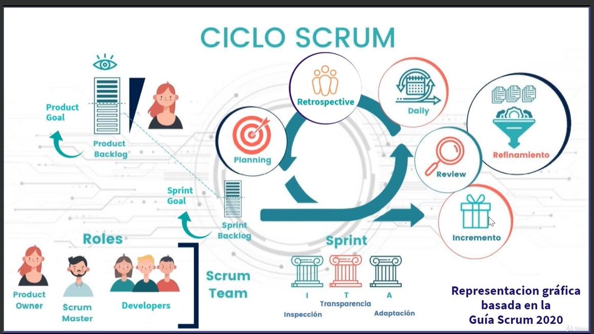

# Ciclo scrum

## Definiciones

Se definen las epicas, historias de usuario, tareas y bugs.

## Priorizacion de las epicas

1. Debe tener (must have)
2. Deberia tener (should have)
3. Podria tener (could have)
4. No debe tener (won't have)

## Estimacion

Se puede desglozar en:

- Entrega de valor
- Riesgo
- Aspectos tecnicos
## Roles

- Scrum Master: Es el responsable de que el equipo siga los principios y valores de Scrum. Se encarga de que el equipo sea autónomo y se auto-organice.
- Product Owner: Es el responsable de maximizar el valor del producto y del trabajo del equipo de desarrollo. Es el encargado de priorizar el backlog del producto.
- Equipo de desarrollo: Es el encargado de entregar un incremento de producto al final de cada sprint.

## Tiempos

Tiempos por actividad:
 
- **Daily Scrum**: 15 minutos
- **Sprint Planning**: 2 horas
- **Sprint Review**: 1 hora
- **Sprint Retrospective**: 1 hora
- **Backlog Refinement**: 1 hora

